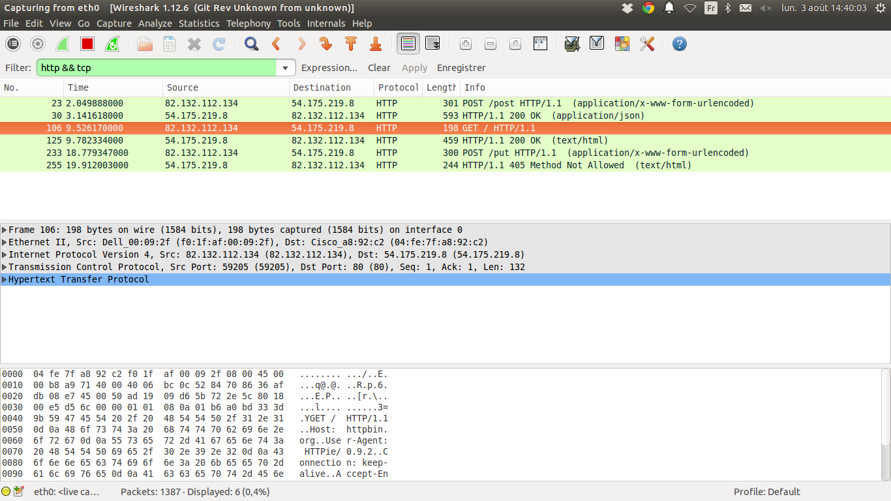
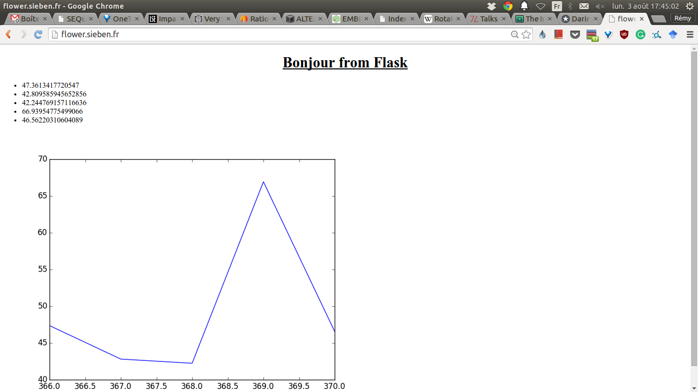
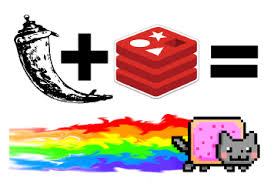

# Final Report - Life of a web request

Valentin Facko, Theresia Deiss, Ozren Mendas

## Introduction

The web is used to simplify communications between people and machines around
the world. The goal of our project is to get a better understanding of the web.
We wanted to learn how to create our own web page. To perform this mission we
had to learn how to program and how to design our own web page.

## Materials and Method

### Raspberry Pi


For creating a simple website the only equipment we needed was a computer, a
stable internet connection and basic knowledge of programming.  To make it as
simple as possible we used the raspberry pi, which is a cheap computer using
the operating system raspbian. 

### Wireshark


The first step of our project was to understand the basic communication between
computers and the internet. For that we used the program wireshark, which
makes it possible to see the transferred information between computers, in
particular the ones from the HTTP protocol. In our researches we got to know,
that HTTP  is based on different verbs, such as GET for getting a document and
POST for posting data on the web. For a wider understanding we also dealt with
the DNS and IP-address, which make it possible to address your request and
getting your answer correctly.  



### Python


As already mentioned the web page should be created with the raspberry pi, on
which the python programming language is already installed. Python is an easy
to learn language, what makes it interesting for beginners.  To get to know
python, we started reading the tutorial [Learning Python the hard
way](http://learnpythonthehardway.org/book), so we were able to program
functions on our own.  For getting content on our website we decided to post
the temperatures of our computer, which can be measured with a sensor on the
raspberry pi. To show changes on that measurements we decided to measure the
current temperature every ten seconds and then upload the last five values,
which are stored, on the website.


### Database redis


For storing the temperatures of the raspberry pi we decided to use a database.
The advantage of a database in contrast to a normal file is that you can query
data more efficiently than with a file. Furthermore, the data can be easy
manipulated. We decided to use Redis, because of its simplicity and also
because mature library already exist to use it in Python.

    import redis
    r = redis.Redis()
    r.rpush("temperature list", 42)

### Flask


[Flask](//flask.pocoo.org) is a lightweight web framework which is used to make
a website. It is a python library. The way it works is that it handles HTTP
requests, dispatches code that generates HTML, and creates an HTTP response
with that content. 

    from flask import Flask
    app = Flask(__name__)

    @app.route("/")
    def hello():
        return "Hello World!"

    if __name__ == "__main__":
        app.run()

### Templates


Because we want to upload every ten seconds the current temperatures, it is not
possible to create a static website. For generating dynamically every web pages,
we use Jinja2 as a template library. When a page is requested, the function
that handle it loads the template in memory and then populates the templates
with the right value.  Because of the stiff measurements the data uploaded on
the website are up to date all the time.

For example this Jinja2 template:

    ```
    <ul>
    
      <li>{{ temp }}</li>
     
    </ul>
    ```

will be transformed into this HTML code ready to be read by the web browser:

    ```
    <ul>
      <li>42</li>
      <li>42.69</li>
      <li>42.96</li>
    </ul>

## Results



Our final website shows the last five measurements of the temperature of the
raspberry pi as well as it compares them in the graph below.

By creating our own website we can quickly see that many programs are
available, for free, on the internet, but just a few are really helpful.  We
used as a tool flask, tembling and the database, because these enabled us to
create an easy script, where all steps, functions and store are working
together, modify each other and can be dynamically uploaded. Through our
lessons in theory we have now a better understanding of the relation between
the internet and the web but also their benefit. The web is a very useful tool
to look up information on a very cheap way and getting always the latest
information. 

In addition, we obtain now a knowledge about different programs, stores and
languages, their advantages and disadvantages and especially we are able to
understand better what we are telling the computer by giving a command and what
the computer is telling us by giving back an error. Having experience in
Computer Science leads to a logical way of thinking, being able to understand
abstract models and transferring this quality also into other disciplines of
science.



## Conclusion

We managed to finish a web page that fulfilled our goal.  As a next step, we
could improve the design of the website and make it look pretty on more devices
such as mobile phones and tablets. We could also include as a further step a
full-duplex connection such as the ones provided by websockets. Which makes it
possible to receive new updates without having to explicitly send a new request
for them.

## References

- [The Internet by Jessica McKellar](https://speakerdeck.com/pyconslides/the-internet-by-jessica-mckellar)

### Raspberry Pi

- [how to make a sensor](https://www.raspberrypi.org/learning/temperature-log)

### Python programming

- [Python](//python.org)
- [Learn Python the hard way](//learnpythonthehardway.org/book/)
- [Flask](//flask.pocoo.org)
- [Jinja2](//jinja.pocoo.org)


### Redis

- [Redis](//redis.io)
- [Try redis](//try.redis.io)

### HTML

- [Reveal.js](http://lab.hakim.se/reveal-js/)
- [Mozilla Developer Network](https://developer.mozilla.org/fr/)
